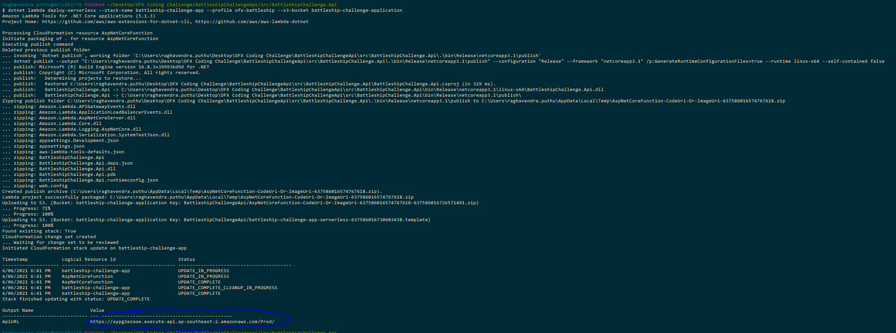

# Battleship API

This is a simple restful API for implementing the Battleship game, rules are listed [here](./SolutionItems/OFX_Coding_Exercise2020.pdf)

## code journey

added base project template from visual studio

deployed the default project to personal aws account, steps listed below

added domain controllers, service and data layers to the design, data layer being a simple in-memory object to store the state

added skeleton failing tests using xunit

added dependency injection to load the concrete implementations

added narrow integration tests for the main api calls

throroughly unit tested Fetch coordinates logic for adding a new ship to the board

## tests approach

following the pattern of narrow integration tests by martin fowler https://martinfowler.com/bliki/IntegrationTest.html,
the idea is to run a complete e2e test by having a testdouble/mock at the end for external dependencies, this gives a robust test suite along with unit tests where needed

 components used for testing:

* xunit
* builder pattern to build the models
* narrow integration tests principles  https://martinfowler.com/bliki/IntegrationTest.html
* fluentAssertions  

## Application Deployment

### Setup AWS on dev machine:
- install aws cli (ref: https://docs.aws.amazon.com/cli/latest/userguide/cli-chap-install.html)
- configure cli with the profile ofx-battleship (or your preferable profile name) (ref: https://docs.aws.amazon.com/cli/latest/userguide/cli-configure-quickstart.html)
  (update the preferred profile name in aws-lambda-tools-defaults.json file)

### Deployment (ref: https://docs.amazonaws.cn/en_us/toolkit-for-visual-studio/latest/user-guide/lambda-cli-publish.html)
- Setup the amazon toolKit for Visual Studio (ref: https://docs.amazonaws.cn/en_us/toolkit-for-visual-studio/latest/user-guide/setup.html#install)
- install Amazon.Lambda.Tools as a global tool, cmd to run: `dotnet tool install -g Amazon.Lambda.Tools`
- dotnet lambda --help will list out the helpful commands
- dotnet lambda deploy-serverless --stack-name battleship-challenge-app --profile ofx-battleship --s3-bucket battleship-challenge-application
- command above should deploy the application template serverless.template which includes an api gateway pointing to the lambda as an endpoint having the application code
 
- url to test https://aypg2ezaoe.execute-api.ap-southeast-2.amazonaws.com/Prod/

## Build
### dotnet cli commands
navigate to /src/BattleshipChallenge.Api folder from gitbash 
compile the code: `dotnet build` 
run the application: `dotnet run` 
test the application: `curl -k https://localhost:5001`  
use the postman collection created to test all the requests as per the requirement,

* postman collection json to import to postman client: [allCallsPostmanCollection](./solutionItems/battleshipApi.postman_collection.json)

### visual studio
run the application pointing to BattleshipChallenge.Api as startup project with defaulting to IIS express 
this should start the project on port 44384 https://localhost:44384/  

## Test
navigate to /tests/BattleshipChallengeApi.Tests folder 
run all the tests: `dotnet test`  

## Assumptions made
- as there is no persistance needed, using an im-memory allocation for storing the state of a game
- if persistance exists, there would be a three tier design with BattleshipChallenge.Data project managing the repository layer
- when a Ship is added from the api, the response returns the `OccupiedCoordinates`, `HitCoordinates` it is assigned to, this should not happen, its returned for reviewing the attack call

